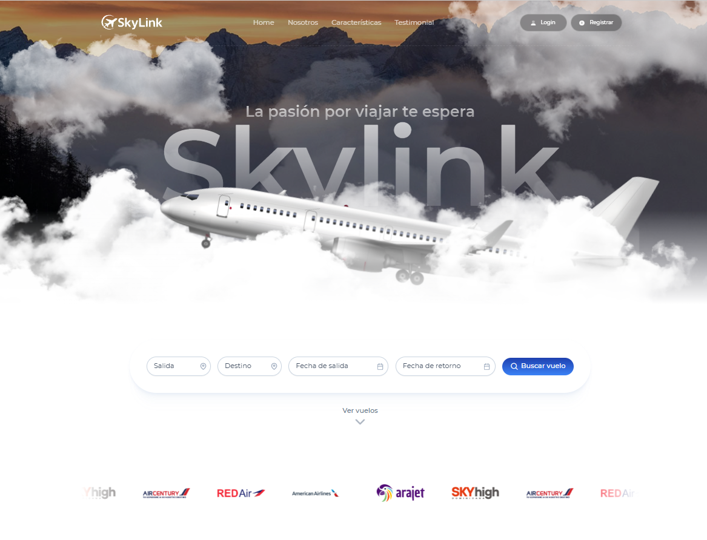

# SkyLink ✈️ - Sistema Web de Reservación de Vuelos


<div align="center">
  
  <p><em>Tu conexión al cielo, simplificada</em></p>
</div>

## 📋 Índice

- [Descripción](#-descripción)
- [Características](#-características)
- [Tecnologías](#-tecnologías)
- [Estructura del Proyecto](#-estructura-del-proyecto)
- [Instalación](#-instalación)
- [Uso](#-uso)
- [Aerolíneas Asociadas](#-aerolíneas-asociadas)
- [Capturas de Pantalla](#-capturas-de-pantalla)
- [API y Servicios](#-api-y-servicios)
- [Contribución](#-contribución)
- [Licencia](#-licencia)

## 🚀 Descripción

SkyLink es una plataforma web moderna para la reservación de vuelos que conecta a los viajeros con múltiples aerolíneas en un solo lugar. Diseñada con una interfaz intuitiva y elegante, SkyLink permite a los usuarios buscar, comparar y reservar vuelos de manera rápida y sencilla.

## ✨ Características

- 🔍 **Búsqueda avanzada de vuelos** con filtros por origen, destino y fecha
- 🎫 **Visualización detallada** de vuelos disponibles con información completa
- 💺 **Selector interactivo de asientos** con diferentes clases y precios
- 👤 **Gestión de perfiles** de usuario y pasajeros
- 💳 **Sistema de pago simulado** integrado
- 📱 **Diseño responsive** adaptado a todos los dispositivos
- 🌐 **Soporte multiidioma** (Español e Inglés)
- 🔒 **Autenticación segura** de usuarios
- 📊 **Panel de administración** para gestión de vuelos (para aerolíneas)

## 🛠️ Tecnologías

- **Frontend:**
  - [Angular 19](https://angular.io/) - Framework de desarrollo
  - [PrimeNG 19](https://primeng.org/) - Biblioteca de componentes UI
  - [TailwindCSS](https://tailwindcss.com/) - Framework CSS utilitario
  - [NgRx](https://ngrx.io/) - Gestión de estado
  - [RxJS](https://rxjs.dev/) - Programación reactiva

- **Herramientas de Desarrollo:**
  - TypeScript
  - ESLint
  - Prettier
  - Karma/Jasmine (Testing)

## 📁 Estructura del Proyecto

```
SkyLink-Frontend/
├── src/
│   ├── app/
│   │   ├── core/                 # Servicios, guardias, interceptores y modelos core
│   │   ├── layout/               # Componentes de layout (menú, topbar, etc.)
│   │   ├── pages/                # Páginas y componentes de la aplicación
│   │   │   ├── airline-demo/     # Componentes específicos para la demo de aerolíneas
│   │   │   ├── auth/             # Componentes de autenticación
│   │   │   ├── dashboard/        # Dashboard y widgets
│   │   │   ├── landing/          # Página de inicio
│   │   │   └── service/          # Servicios para las páginas
│   │   ├── shared/               # Componentes, directivas y pipes compartidos
│   │   └── store/                # Estado global de la aplicación (NgRx)
│   ├── assets/                   # Recursos estáticos (imágenes, iconos, etc.)
│   │   ├── banners/              # Banners de aerolíneas
│   │   ├── i18n/                 # Archivos de traducción
│   │   ├── icons/                # Iconos de la aplicación
│   │   └── logos/                # Logos de SkyLink y aerolíneas
│   └── environments/             # Configuraciones por entorno
└── ...
```

## 🔧 Instalación

1. **Clonar el repositorio:**
   ```bash
   git clone https://github.com/tu-usuario/SkyLink-Frontend.git
   cd SkyLink-Frontend
   ```

2. **Instalar dependencias:**
   ```bash
   npm install
   ```

3. **Iniciar el servidor de desarrollo:**
   ```bash
   npm start
   ```

4. **Abrir en el navegador:**
   ```
   http://localhost:4200
   ```

## 📖 Uso

### Búsqueda de Vuelos

1. En la página principal, utiliza el formulario de búsqueda para seleccionar:
   - Aeropuerto de origen
   - Aeropuerto de destino
   - Fecha de viaje
   - Número de pasajeros

2. Haz clic en "Buscar" para ver los vuelos disponibles.

### Reserva de Vuelos

1. Selecciona el vuelo deseado de la lista de resultados.
2. Elige los asientos para cada pasajero.
3. Completa la información de los pasajeros.
4. Procede al pago utilizando el método preferido.
5. Recibe la confirmación de tu reserva por correo electrónico.

## ✈️ Aerolíneas Asociadas

SkyLink trabaja con las siguientes aerolíneas para ofrecer la mejor experiencia de vuelo:

- **Arajet** - Conexiones a Norteamérica y el Caribe
- **Air Century** - Vuelos regionales y nacionales
- **Red Air** - Destinos internacionales selectos
- **American Airlines** - Conexiones globales
- **Dominicana** - Especialista en rutas nacionales

## 📸 Capturas de Pantalla

<div align="center">
  <p><strong>Página de Inicio</strong></p>
  
  
  <p><strong>Búsqueda de Vuelos</strong></p>
  <em>Interfaz intuitiva para encontrar el vuelo perfecto</em>
  
  <p><strong>Selector de Asientos</strong></p>
  <em>Elige tu asiento ideal con nuestra interfaz interactiva</em>
  
  <p><strong>Proceso de Pago</strong></p>
  <em>Proceso de pago simulado</em>
</div>

## 🔌 API y Servicios

SkyLink se conecta a una API RESTful para obtener y gestionar datos:

- **Autenticación:** `/api/auth/login`, `/api/auth/register`
- **Vuelos:** `/api/flights`, `/api/flights/{id}`
- **Reservas:** `/api/bookings`, `/api/bookings/{id}`
- **Usuarios:** `/api/users`, `/api/users/{id}`

En entorno de desarrollo, se utilizan datos simulados para facilitar las pruebas.

## 👥 Contribución

¡Agradecemos tu interés en contribuir a SkyLink! Para contribuir:

1. Haz un fork del repositorio
2. Crea una rama para tu característica (`git checkout -b feature/amazing-feature`)
3. Haz commit de tus cambios (`git commit -m 'Add some amazing feature'`)
4. Push a la rama (`git push origin feature/amazing-feature`)
5. Abre un Pull Request

## 📄 Licencia

Este proyecto está licenciado bajo la Licencia MIT - ver el archivo [LICENSE.md](LICENSE.md) para más detalles.

---

<div align="center">
  <p>Desarrollado con ❤️ por darling.dev</p>
  <p>
    <a href="https://github.com/tu-usuario/SkyLink-Frontend">GitHub</a> •
    <a href="mailto:info@darlingf1998@gmail.com">Contacto</a>
  </p>
</div>
